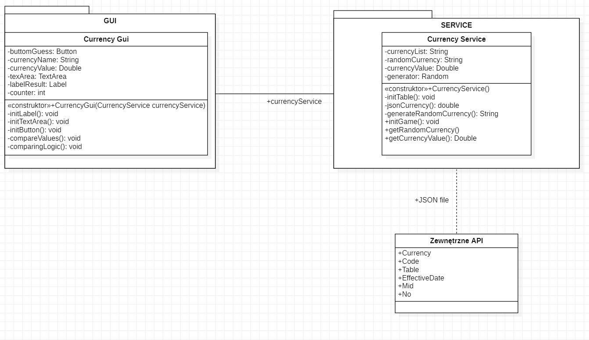

# Gra walutowa
### Klasa CurrencyGui.java:
@Route("/currency-game") - ustawia endpoint, na którym będzie działać nasza aplikacja. 
Klasa VerticalLayout rozszerza klasę CurrencyGui. Jest odpowiedzialny za układ strony jedno pod drugim.
Dodatkowo w klasie CurrencyGui znajduje się zaimplementowanie całego frontu za 
pomocą vaadina czyli: pola tekstowe bez możliwości zmiany przez użytkownika, a pokazuje nam 
informacje takie jak:
"Witamy w grze", "Randomowa waluta to". Jest również pole tekstowe gdzie użytkownik wpisuje 
daną kwotę. Użytkownik musi wpisać kwotę oddzieloną kropką, ponieważ jeśli wpisze coś innego 
to ukaże się mu 
informacja o podanym złym formacie kwoty. W aplikacji jest przycisk, który wywołuje funkcję, która porównuje podaną 
kwotę
przez użytkownika z kursem walut i w przypadku podania za niskiej kwoty dostaje komunikat, że 
kwota jest za mała. 
W przypadku podanej za dużej kwoty dostaje również informacje, że kwota jest za duża.
Natomiast kiedy trafi dostaje informacje, że wygrał oraz ilość prób zanim zgadł dokładną liczbę.
W tej klasie jak przed chwilą wspomniałam znajduje się licznik, który się zwiększa po każdym
 nie trafieniu.
 ### Klasa CurrencyService.java:
 @Service -  wykonuje jakąś czynność, odpowiada za wykonywanie danych
zadań.
 Klasa CurrencyService.java odpowiada w głownej mierze za połączenie z zewnętrznym api, które znajduje się na stronie http://api.nbp.pl/ oraz
 pobieranie obecnego kursu walut w walutach takich jak : USD, EUR, GBP, CHF,
  HUF,  RUB, NOK, HKD w formacie JSON. Również w tej klasie jest stworzona metoda do losowania waluty ze stworzonej tablicy z konkretnymi walutami, którą użytkownik będzie 
musiał odgadnąć obecną wartość.  Dodatkowo po pobraniu danych są one przechowywane do 2 liczb po przecinku, ponieważ w kursach walut
liczby są podawane z 4 miejscami po przecinku.
 ### Technologie:
 Do utworzenia gry walutowej została wykorzystana Java 8
 wraz z dwoma frameworkami : Vaadin 13 oraz Spring Boot

### Pakiet Resources:
vaadin.compatibilityMode = true -po ustawieniu kompatybilności na true włącza tryb zgodności
 Vaadin 13. Vaadin wtedy korzysta 
z Bower oraz Webjarsa aby obsłużyć frontend zamiast npm i webpacka.

### Link do aplikacji :
https://currency-game.herokuapp.com/currency-game
### Diagram klas:

